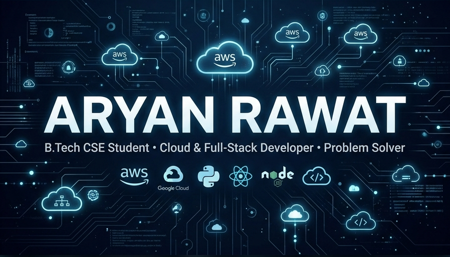

# 💻 Aryan Rawat
**B.Tech CSE Student @ Lovely Professional University | Cloud & Full-Stack Developer**

---

### 🚀 About Me

I am a **Computer Science & Engineering student** at LPU with a strong focus on building scalable, cloud-native applications. Currently, I am honing my backend engineering skills as a **Java Development Intern** at Labmentix. I have a deep interest in **Cloud Computing (AWS)**, **Serverless Architectures**, and **Full-Stack Development**.

Beyond code, I am an **NCC Gold Medalist** in Debate and a former National-level football player, which has instilled in me a high degree of discipline and team-first leadership.

- 🎓 **Currently**: B.Tech CSE (2023-2027) @ Lovely Professional University
- 💼 **Interning**: Java Development Intern @ Labmentix
- ☁️ **Cloud Focus**: AWS (Lambda, S3, CloudWatch, Serverless)
- 🧠 **Problem Solving**: 150+ Problems solved across LeetCode & HackerRank
- 🎖️ **Values**: Discipline, Precision, and Continuous Innovation

---

### 🛠️ Technical Arsenal

<table>
  <tr>
    <td align="center" width="25%"><strong>Languages</strong></td>
    <td align="center" width="25%"><strong>Cloud & DevOps</strong></td>
    <td align="center" width="25%"><strong>Web & Frameworks</strong></td>
    <td align="center" width="25%"><strong>Tools & DBs</strong></td>
  </tr>
  <tr>
    <td align="center">
       
       
       
      
    </td>
    <td align="center">
       
       
       
      
    </td>
    <td align="center">
       
       
       
      
    </td>
    <td align="center">
       
       
       
      
    </td>
  </tr>
</table>

---

### 📊 Engineering Stats

  
  

  

---

### 🔥 Featured Projects

| Project | Description | Tech Stack |
| :--- | :--- | :--- |
| **[Smart Serverless Pipeline](https://github.com/RawatAr/RawatAr)** | Event-driven pipeline on AWS enabling scalable, automated processing with full observability. | `AWS Lambda` `S3` `CloudWatch` |
| **[AI Travel Planner](https://github.com/RawatAr/RawatAr)** | Flask-based backend system handling real-time data processing for personalized itineraries. | `Flask` `REST APIs` `Python` |
| **[Java GUI Dashboard](https://github.com/RawatAr/RawatAr)** | Hands-on Java application featuring modular UI design and predictive model integration. | `Java Swing` `JavaFX` |

---

### 🤝 Connect with Me

 

  

